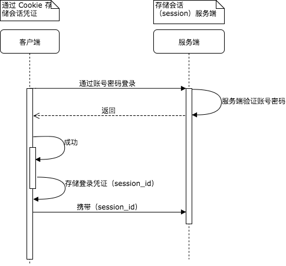

# JWT　认证登录

## 背景

WEB 服务用户认证的一般流程：

1. 用户向服务器发送用户名和密码
2. 服务器验证通过后，在当前对话（session）里面保存相关数据，比如用户角色、登录时间等等。
3. 服务器向用户返回一个 session_id，写入用户的 Cookie。
4. 用户随后的每一次请求，都会通过 Cookie，将 session_id 传回服务器。
5. 服务器收到 session_id，找到前期保存的数据，由此得知用户的身份。



很容易看出其扩展性不好，即在要需要服务集群部署时，必须要求会话数据共享。

JWT 技术的基本逻辑就是，服务器不再存储会话数据，而是将所用到的数据存储在客户端，服务端只需通过加密算法验证其正确性。

## 简介

学习 JWT 验证的例子。里面的例子都来源网络中开源的代码，链接地址见文档最下面的参考链接。

## 目录结构
./asset - 工程所用的静态文件，READMEME.md 文件中用到的图片
./server - 服务端代码
├── /demo1 - 客户端通过 Cookie 自动认证
├── /demo2 - 客户端通过 HTTP 中 Authorization 字段自动认证
├── /demo3 - token 的单次验证
├── /demo4 - 涉及简单的权限认证
├── main.js - 主入口
./html - 前端 HTML 文件
├── /jwt - jwt.io 例子中所用到的 HTML 文件
│   └── end
./test - 项目测试目录
└── end

## JWT 的基本知识

除了遵循客户端与服务端之间的认证逻辑之外，JWT 的内容也是有基本格式和需要特定算法加密的。

### 原理

服务器认证通过之后，生成 JSON 对象发回给用户。之后的用户与服务器的通信都会携带这个 JSON 对象。

### 数据结构

比如通过 JWT 传输下面数据：

```json
{
  "sub": "test",
  "name": "John Doe",
  "role": "admin",
  "iat": 1516239022
}
```

加密后的数据：

<pre style="background:#f7f7f7;">
<span style="color:#fb015b;font-weight:bold;">eyJhbGciOiJIUzI1NiIsInR5cCI6IkpXVCJ9.</span>
<span style="color:#d63aff;font-weight:bold;">eyJzdWIiOiJ0ZXN0IiwibmFtZSI6IkpvaG4gRG9lIiwicm9sZSI6ImFkbWluIiwiaWF0IjoxNTE2MjM5MDIyfQ.</span>
<span style="color:#00b9f1;font-weight:bold;">Q4Za9YfEXU_EY2ppYWUu01rWizyYIubwqSBR_IaK7BI</span>
</pre>

字符串中通过点（.）可分割成三个部分，分别表示：

<pre style="background:#f7f7f7;">
<span style="color:#fb015b;font-weight:bold;">Header（头部）.</span>
<span style="color:#d63aff;font-weight:bold;">Payload（负载/数据）.</span>
<span style="color:#00b9f1;font-weight:bold;">Signature（签名）</span>
</pre>

* Header

  ```json
  {
    "alg": "HS256",
    "typ": "JWT"
  }
  ```

  `alg`属性表示签名的算法（algorithm），默认是 HMC SHA256（写成 HS256）;`typ`属性表示这个令牌（token）的类型（type），JWT 令牌统一写成JWT。最后，将上面的 JSON 对象使用 Base64URL 算法转成字符串。

* Payload

  主要用来存放实际要传递的数据。

  官方公布的 7 个字段，供选用：

  ```markdown
  * iss（issuer）:签发人
  * exp（expiration time）:过期时间
  * sub（subject）:主题
  * aud（audience）:受众
  * nbf（Not Before）:生效时间
  * iat（Issued At）:签发时间
  * jti（JWT ID）:编号
  ```

  这些数据默认是不加密的，只是使用 `Base64URL` 算法转成了字符串。

* Signature

  Signature 部分是对前面两部分的签名，防止数据篡改。

  首先，需要指定一个密钥（secret）。这个密钥只有服务器才知道，不能泄露给用户。然后，使用 Heather 里面指定的签名算法（默认是 HMAC SHA256），按照下面的公式产生签名。

  ```js
  HAMCSHA256(
  base64UrlEncode(header) + "." +
  base64UrlEncode(payload),
  secret)
  ```

算出签名以后，把 Header 、Payload、Signature 三分部分拼成一个字符串，每个部分之间用“点”（.）分隔，就可以返回给用户。

> 注意：前面的 Header 和 Payload 字段需要通过 Base64URL 转化成字符串。Base64URL 与 Base64 算法略有不同。需要将 `+`、`/`和`=`替换掉，`=`被省略，`+`替换成`-`，`/`替换成`_`，然后进行 Base64 转换。

### 客户端使用 JWT 的方式

1. 将 JWT 存储在 Cookie 中，这样客户端每次发送请求时，都会自动携带上 JWT。缺点是不能跨域。并且每一个请求都会携带 cookie，这包括图片请求和 CSS 请求，造成资源浪费。
2. 存储在 localstorage 中，发送 POST 请求时，将其放在 HTTP 中，如 `Authorizaion`。

## 常见问题及答案

+ 把 JWT 放在 URL 或者 Header 中能保证安全吗？

  不能的。明文传出 Token 总是不安全的，除非我们使用了 SSl/TLS 去加密我们的连接。不过可以首先做一些简单的安全防护，像：检测请求是否来自相同的 user-agent 或者 IP 地址。[连接地址1](https://softwareengineering.stackexchange.com/questions/122372/is-browser-fingerprinting-a-viable-technique-for-identifying-anonymous-users) [链接店址2](https://stackoverflow.com/questions/216542/how-do-i-uniquely-identify-computers-visiting-my-web-site/3287761#3287761)

  解决方法：

    + 使用单次的 token（链接点击后，token 过期）。
    + 在较高安全要求时，不在 url 携带 token 去验证。（在进行交易时，不使用通过链接完成支付）

  使用案例：
    
    +  [账号验证——邮件验证账号注册]()
    +  [重置密码——向邮件发送修改密码的链接]()

+ 如何使会话失效？

  对于 JWT，它是无状态的，它可以通过任何集群中的节点和不向数据库发请求的方式进行验证。所以使会话失效的主要方式是将 token 存储在数据库中，比如：level DB、Redis和内存缓存。

## 参考链接

* [阮一峰 JWT](http://www.ruanyifeng.com/blog/2018/07/json_web_token-tutorial.html)
* [jwt.io](https://github.com/dwyl/learn-json-web-tokens)
* [https://blog.bitsrc.io/understanding-json-web-token-authentication-a1febf0e15](https://blog.bitsrc.io/understanding-json-web-token-authentication-a1febf0e15)
* [https://blog.usejournal.com/sessionless-authentication-withe-jwts-with-node-express-passport-js-69b059e4b22c](https://blog.usejournal.com/sessionless-authentication-withe-jwts-with-node-express-passport-js-69b059e4b22c)
* []()